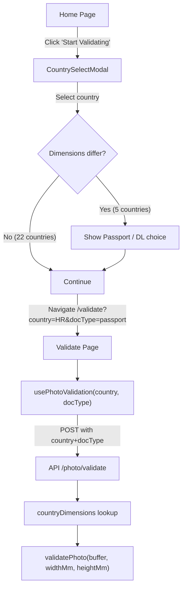

# Country & Document Type Selection

## Architecture Overview




## Countries Requiring Doc Type Choice (dimensions differ)

- Croatia: Passport 35×45, DL 30×35
- Estonia: Passport 40×50, DL 35×45
- Finland: Passport 36×47, DL 35×45
- Greece: Passport 40×60, DL 35×45
- Spain: Passport 35×45, DL 32×26

All other 22 countries: both use 35×45 mm (no choice shown).

## Files to Create

- `[src/lib/country-config.ts](src/lib/country-config.ts)` — country data: name, passport dims, DL dims, requiresChoice flag
- `[src/components/CountrySelectModal.tsx](src/components/CountrySelectModal.tsx)` — Dialog with country dropdown + conditional doc type radio buttons

## Files to Modify

- `[src/pages/home.tsx](src/pages/home.tsx)` — Replace `Link href="/validate"` with state + modal trigger; navigate on confirm
- `[src/types/api.ts](src/types/api.ts)` — Add optional `country` and `docType` fields to `ValidationRequest`
- `[src/api/client.ts](src/api/client.ts)` — Accept and forward `country`/`docType` in `validatePhoto()`
- `[src/hooks/usePhotoValidation.ts](src/hooks/usePhotoValidation.ts)` — Accept `country` and `docType` props, pass to API call
- `[src/pages/validate.tsx](src/pages/validate.tsx)` — Read `?country=` and `?docType=` from URL; pass to hook
- `[server/validation-constants.ts](server/validation-constants.ts)` — Add `COUNTRY_DIMENSIONS` map (27 entries) and `DocumentType` constant
- `[api/index.ts](api/index.ts)` — Add optional `country` and `docType` to `ValidationSchema`; derive dimensions and pass to `validatePhoto`
- `[server/photo-validator.ts](server/photo-validator.ts)` — Accept optional `widthMm`/`heightMm` params; fall back to `ICAOConfig` defaults

## Key Implementation Details

`**src/lib/country-config.ts**` — typed data structure:

```typescript
export type DocType = 'passport' | 'drivers_license';
export interface CountryConfig {
  code: string; // ISO 3166-1 alpha-2
  name: string;
  passport: { widthMm: number; heightMm: number };
  driversLicense: { widthMm: number; heightMm: number };
  requiresChoice: boolean; // true when passport ≠ DL dims
}
```

`**CountrySelectModal**` — uses existing shadcn/ui `Dialog`, `Select`, and `RadioGroup` components. "Continue" button disabled until country is selected (and doc type if required).

**URL params** — selection passed as `?country=HR&docType=passport` to `/validate` so the page is shareable and back-navigation works cleanly.

**Server** — `validatePhoto(imageBuffer, widthMm?, heightMm?)` uses passed dims or falls back to `ICAOConfig` defaults (35×45). The existing `processImage` → `validateFinalGeometry` pipeline is unaffected; only the target pixel dimensions change.


## Look  
**Option B — Modal with a searchable Combobox + card-style doc type picker**

A Dialog with a Combobox (type to filter countries, with flag emoji next to each name). When a country with differing dimensions is selected, two large clickable cards appear side-by-side — one for Passport, one for Driver's License, each with an icon and the exact dimensions shown (e.g. "35 × 45 mm").

- Pro: Fast filtering, visually clear, dimensions are visible so user can self-verify

- Con: Needs a Combobox component (shadcn has one, but it needs wiring)

