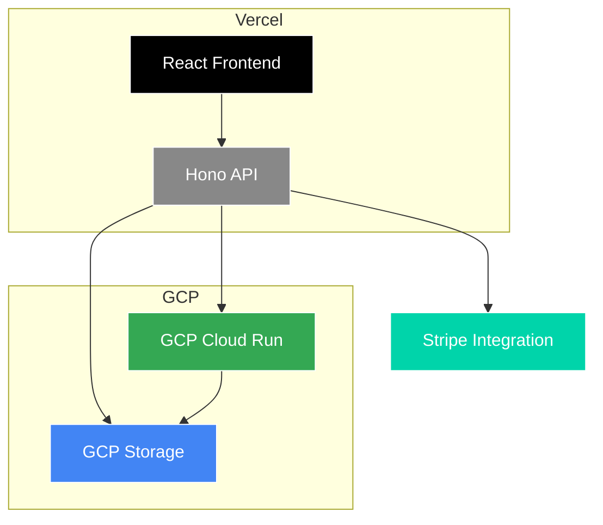

# Photo Validator

A passport photo validation system using computer vision and ML to ensure compliance with official ICAO photo requirements.

This project uses a modern hybrid architecture with React frontend, Vercel API for orchestration, and GCP Cloud Run for heavy ML processing.

## Architecture Overview

-   **Frontend**: A modern React & TypeScript single-page application, deployed to **Vercel's Edge Network** for global, low-latency access.
-   **Vercel API**: A fast Hono.js API that handles image uploads to GCP Storage and orchestrates GCP Cloud Run processing.
-   **GCP Cloud Run**: Heavy ML processing service for photo validation and face detection.
-   **GCP Storage**: Temporary storage for uploaded images during processing.



## Tech Stack

| Area      | Technology                                                                                                   |
| --------- | ------------------------------------------------------------------------------------------------------------ |
| **Frontend**  | React 19, TypeScript, Vite, Wouter, Tailwind CSS, shadcn/ui                                                  |
| **Vercel API**   | Hono.js, TypeScript, Zod validation, Stripe integration, GCP Storage integration                     |
| **GCP Cloud Run** | Python, Flask, OpenCV, InsightFace, ONNX Runtime                                                          |
| **Deployment**| Vercel (Frontend & API), GCP Cloud Run (ML Processing), GCP Storage (Image Storage)                                                          |

## Project Structure

```
.
├── src/                  # React/TypeScript frontend source
│   ├── api/              # Frontend API client (uses Tanstack Query)
│   ├── components/       # Reusable UI components
│   └── pages/            # Application pages
├── api/                  # Hono.js API backend (Vercel)
│   ├── index.ts          # Main Hono application
│   └── lib/              # Shared utilities
│       ├── gcp-storage.ts # GCP Storage integration
│       ├── gcp-run.ts    # GCP Cloud Run client
│       └── .stripe.ts    # Stripe configuration
├── gcp-api/              # GCP Cloud Run service
│   ├── src/
│   │   ├── app.py        # Flask application
│   │   ├── lib/          # ML processing modules
│   │   └── requirements.txt
│   └── Dockerfile        # Container configuration
├── public/               # Static assets for the frontend
├── .gitignore            # Git ignore configuration
├── vercel.json           # Vercel project configuration
└── env.example           # Environment variables template
```

## API Flow

### Quick Check Flow
1. Frontend uploads image to Vercel API
2. Vercel API uploads image to GCP Storage with UUID
3. Vercel API triggers GCP Cloud Run with quick_check event
4. GCP Cloud Run downloads image and performs face detection
5. Results returned to Vercel API, then to frontend

### Full Validation Flow
1. Frontend uploads image to Vercel API
2. Vercel API uploads image to GCP Storage with UUID
3. Vercel API triggers GCP Cloud Run with validate_photo event
4. GCP Cloud Run downloads image and performs full ICAO validation
5. Validated image stored back to GCP Storage
6. Results returned to Vercel API, then to frontend

## Local Development & Deployment

### Prerequisites

-   Node.js (v20+)
-   npm or yarn
-   GCP Project with Cloud Run and Storage enabled
-   Docker (for local GCP API testing)

### Running Locally

1.  **Install Dependencies**:
    ```bash
    npm install
    ```

2.  **Set up Environment Variables**:
    ```bash
    cp env.example .env
    # Edit .env with your Stripe keys and GCP configuration
    ```

3.  **Start Development Server**:
    ```bash
    npm run dev
    ```
    
    This will start both the frontend and Vercel API using Vite with the Hono dev server plugin.
    The application will be available at `http://localhost:3000`

4.  **Run GCP API Locally** (optional):
    ```bash
    npm run gcp:run
    ```

### Deployment

This project requires deployment to both Vercel and GCP:

-   **Frontend & Vercel API**: Pushing to the `main` branch automatically deploys both to Vercel.
-   **GCP Cloud Run**: Deploy using the provided Dockerfile and deployment scripts.
-   **Environment Variables**: Set up your environment variables in both Vercel and GCP.

## License

This is a private project. All rights reserved.
