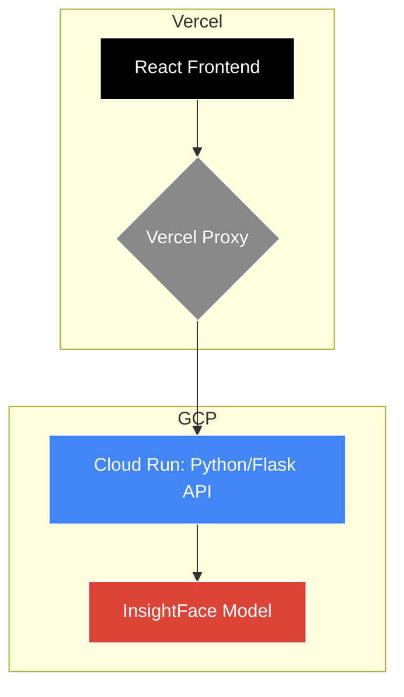

# Baby Picture Validator

A passport photo validation system using computer vision and ML to ensure compliance with official ICAO photo requirements.

This project uses a high-performance hybrid architecture, combining a fast, static frontend with a powerful, containerized machine learning backend.

## Architecture Overview

-   **Frontend**: A modern React & TypeScript single-page application, deployed to **Vercel's Edge Network** for global, low-latency access.
-   **Backend**: A robust Python API powered by Flask and InsightFace, containerized with Docker and deployed to **GCP Cloud Run** for scalable, on-demand processing.
-   **Proxy**: Vercel Serverless Functions act as a lightweight proxy, securely routing requests from the frontend to the GCP backend.



## Tech Stack

| Area      | Technology                                                                                                   |
| --------- | ------------------------------------------------------------------------------------------------------------ |
| **Frontend**  | React 19, TypeScript, Vite, Wouter, Tailwind CSS, shadcn/ui                                                  |
| **Backend**   | Python, Flask, InsightFace, ONNX Runtime, OpenCV, Gunicorn                                                 |
| **Deployment**| Vercel (Frontend & Proxy), Docker, GCP Cloud Run (Backend API), GCP Cloud Build, GitHub Actions (CI/CD) |

## Project Structure

```
.
├── gcp-api/              # Self-contained Python/Flask backend for GCP
│   ├── app.py            # Main Flask application with global model loading
│   ├── lib/              # Core computer vision & validation logic
│   ├── tests/            # Python unit & integration tests
│   ├── Dockerfile        # Docker container definition for Cloud Run
│   └── requirements.txt  # Python dependencies
├── src/                  # React/TypeScript frontend source
│   ├── api/              # Frontend API client (uses Tanstack Query)
│   ├── components/       # Reusable UI components
│   └── pages/            # Application pages
├── api/                  # Vercel Serverless Functions (Proxy)
│   └── [...path].js      # Dynamic proxy to forward requests to GCP
├── public/               # Static assets for the frontend
├── scripts/              # Deployment scripts
├── .gitignore            # Git ignore configuration
├── DEPLOYMENT.md         # Detailed deployment instructions
└── vercel.json           # Vercel project configuration
```

## Local Development & Deployment

### Prerequisites

-   Node.js (v20+)
-   Python (v3.12+)
-   Google Cloud SDK (`gcloud`)
-   Docker Desktop

### Running Locally

1.  **Start the Frontend**:
    ```bash
    npm install
    npm run dev
    ```
    The frontend will be available at `http://localhost:3000`.

2.  **Start the Backend**:
    For detailed instructions on running the Python backend locally (with or without Docker), please see the `DEPLOYMENT.md` file.

### Deployment

This project is configured for automated deployments:

-   **Frontend (Vercel)**: Pushing to the `main` branch automatically deploys the frontend.
-   **Backend (GCP)**: Pushing to the `main` branch triggers a GitHub Action to build and deploy the Docker container to GCP Cloud Run.

For manual deployment steps and initial setup, please refer to the complete **[DEPLOYMENT.md](DEPLOYMENT.md)** guide.

## License

This is a private project. All rights reserved.
