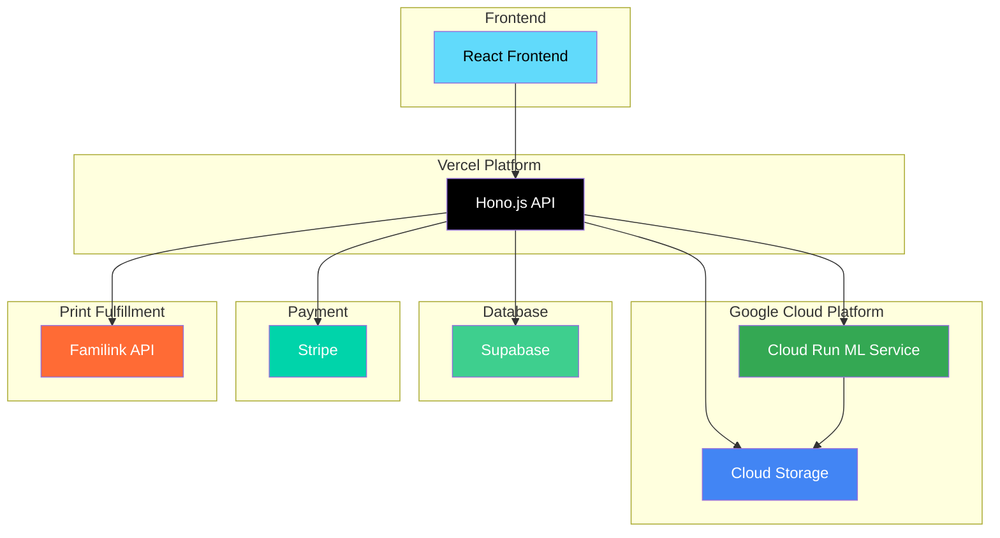

# Photo Validator

A comprehensive passport photo validation system using computer vision and machine learning to ensure compliance with official ICAO photo requirements. The system provides both quick face detection checks and full ICAO compliance validation for passport photos.

## System Overview

The Photo Validator is a modern, cloud-native application that validates passport photos against international standards. It combines a React frontend with serverless backend processing to deliver fast, accurate photo validation services.


## System Components

### Frontend (React/TypeScript)
- **Location**: `src/` directory
- **Technology**: React 19, TypeScript, Vite, Tailwind CSS, shadcn/ui
- **Features**: Photo upload, validation results display, payment integration
- **Deployment**: Vercel Edge Network for global performance

### Backend API (Hono.js)
- **Location**: `api/` directory  
- **Technology**: Hono.js, TypeScript, Zod validation
- **Features**: Image upload orchestration, payment processing, order management
- **Deployment**: Vercel Serverless Functions

### ML Processing Service (Python/Flask)
- **Location**: `gcp-api/` directory
- **Technology**: Python, Flask, OpenCV, InsightFace, ONNX Runtime
- **Features**: Face detection, ICAO compliance checking, image processing
- **Deployment**: Google Cloud Run

### Database (PostgreSQL)
- **Technology**: PostgreSQL with Drizzle ORM
- **Features**: Order tracking, payment records, validation results
- **Deployment**: Supabase (production) or Docker (development)

## External Services

### Google Cloud Platform
- **Cloud Run**: Serverless container execution for ML processing
- **Cloud Storage**: Temporary image storage during processing

### Database
- **Supabase**: Managed PostgreSQL database with additional features

### Payment Processing
- **Stripe**: Payment processing and webhook handling
- **Features**: One-time payments, webhook validation, refund processing

### Print Fulfillment
- **Familink API**: Photo printing and delivery service
- **Features**: Order printed photos, shipping to users, order tracking

### Development Tools
- **Docker**: Local development environment
- **Drizzle ORM**: Database schema management and migrations
- **Vercel**: Frontend and API deployment platform

## Architecture Diagram



## Tech Stack

| Component | Technology | Purpose |
|-----------|------------|---------|
| **Frontend** | React 19, TypeScript, Vite, Tailwind CSS | User interface and photo upload |
| **Backend API** | Hono.js, TypeScript, Zod | Request handling and orchestration |
| **ML Processing** | Python, Flask, OpenCV, InsightFace | Photo validation and compliance checking |
| **Database** | PostgreSQL, Drizzle ORM | Data persistence and order management |
| **Payments** | Stripe API | Payment processing and webhooks |
| **Print Fulfillment** | Familink API | Photo printing and delivery service |
| **Storage** | Google Cloud Storage | Temporary image storage |
| **Deployment** | Vercel, Google Cloud Run | Serverless hosting and container execution |

## Project Structure

```
photo-validator/
├── src/                          # React frontend
│   ├── components/               # UI components
│   │   ├── photo-uploader/      # Photo upload interface
│   │   └── ui/                   # Reusable UI components
│   ├── pages/                    # Application pages
│   ├── hooks/                    # Custom React hooks
│   └── lib/                      # Utility functions
├── api/                          # Hono.js backend
│   ├── index.ts                  # Main API application
│   └── lib/                      # Backend utilities
│       ├── database.ts           # Database connection
│       ├── order-service.ts      # Order management
│       ├── fulfillment.ts        # Payment fulfillment
│       └── admin-actions.ts     # Admin operations
├── gcp-api/                      # ML processing service
│   ├── src/                      # Python source code
│   │   ├── app.py               # Flask application
│   │   ├── lib/                 # ML processing modules
│   │   └── models/              # ML model files
│   └── Dockerfile               # Container configuration
├── drizzle/                     # Database migrations
├── docker-compose.yml           # Local development setup
└── vercel.json                 # Vercel configuration
```

## Getting Started

For detailed setup instructions, see [DEVELOPMENT.md](./DEVELOPMENT.md).

### Quick Start

1. **Clone and Install**
   ```bash
   git clone <repository-url>
   cd photo-validator
   npm install
   ```

2. **Environment Setup**
   ```bash
   cp .env.example .env
   # Configure your environment variables
   ```

   Download a service account key to have access to Cloud Vision API and store it as `.gcloud-credentials.json` in the root of the project. Never commit this file (it is in .gitignore).

3. **Start Development**
   ```bash
   # Terminal 1: Start infrastructure services
   npm run dev:full
   
   # Terminal 2: Start frontend and API
   vercel dev
   ```

   **What `npm run dev:full` does:**
   - Starts PostgreSQL database with Docker
   - Runs Drizzle database migrations
   - Starts Google Cloud Storage emulator
   - Starts GCP API service (ML processing) in Docker
   - Starts Stripe webhook listener
   - Provides the infrastructure services needed for development

   **What `vercel dev` does:**
   - Starts the React frontend development server
   - Starts the Hono.js API server
   - Provides hot-reloading for both frontend and API changes
   - Simulates the Vercel production environment locally

## License

This is a private project. All rights reserved.