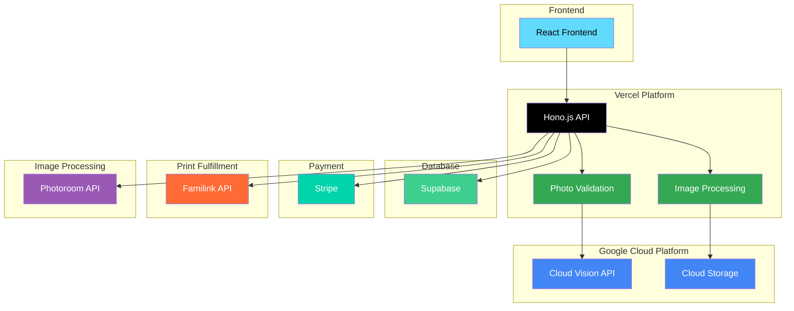

# Photo Validator

A comprehensive passport photo validation system using Google Cloud Vision API to ensure compliance with official ICAO photo requirements. The system provides full ICAO compliance validation for passport photos with automatic cropping and processing.

## System Overview

The Photo Validator is a modern, cloud-native application that validates passport photos against international standards. It combines a React frontend with a TypeScript serverless backend to deliver fast, accurate photo validation services.

## System Components

### Frontend (React/TypeScript)
- **Location**: `src/` directory
- **Technology**: React 19, TypeScript, Vite, Tailwind CSS, shadcn/ui
- **Features**: Photo upload, validation results display, payment integration
- **Deployment**: Vercel Edge Network for global performance

### Backend API (Hono.js/TypeScript)
- **Location**: `api/` directory  
- **Technology**: Hono.js, TypeScript, Zod validation, Sharp, Google Cloud Vision API
- **Features**: Photo validation, image processing, payment processing, order management
- **Deployment**: Vercel Serverless Functions

### Database (PostgreSQL)
- **Technology**: PostgreSQL with Drizzle ORM
- **Features**: Order tracking, payment records, validation results
- **Deployment**: Supabase (production) or Docker (development)

## External Services

### Google Cloud Platform
- **Cloud Vision API**: Face detection, pose analysis, expression validation
- **Cloud Storage**: Image storage for validated photos

### Database
- **Supabase**: Managed PostgreSQL database

### Payment Processing
- **Stripe**: Payment processing and webhook handling
- **Features**: One-time payments, webhook validation, refund processing

### Print Fulfillment
- **Familink API**: Photo printing and delivery service
- **Features**: Order printed photos, shipping to users, order tracking

### Image Processing
- **Photoroom API**: Background removal service

### Development Tools
- **Docker**: Local development environment (PostgreSQL, GCS emulator)
- **Drizzle ORM**: Database schema management and migrations
- **Vercel**: Frontend and API deployment platform

## Architecture Diagram


```mermaid
graph TD
    subgraph "Frontend"
        A[React Frontend]
    end
    
    subgraph "Vercel Platform"
        B[Hono.js API]
        C[Photo Validation]
        D[Image Processing]
    end
    
    subgraph "Google Cloud Platform"
        E[Cloud Vision API]
        F[Cloud Storage]
    end
    
    subgraph "Database"
        G[Supabase]
    end
    
    subgraph "Payment"
        H[Stripe]
    end
    
    subgraph "Print Fulfillment"
        I[Familink API]
    end
    
    subgraph "Image Processing"
        J[Photoroom API]
    end
    
    A --> B
    B --> C
    B --> D
    C --> E
    D --> F
    B --> G
    B --> H
    B --> I
    B --> J
    
    style A fill:#61dafb,color:#000
    style B fill:#000,color:#fff
    style C fill:#34a853,color:#fff
    style D fill:#34a853,color:#fff
    style E fill:#4285f4,color:#fff
    style F fill:#4285f4,color:#fff
    style G fill:#3ecf8e,color:#fff
    style H fill:#00d4aa,color:#fff
    style I fill:#ff6b35,color:#fff
    style J fill:#9b59b6,color:#fff
```

## Tech Stack

| Component | Technology | Purpose |
|-----------|------------|---------|
| **Frontend** | React 19, TypeScript, Vite, Tailwind CSS | User interface and photo upload |
| **Backend API** | Hono.js, TypeScript, Zod, Sharp | Request handling, validation, image processing |
| **Vision AI** | Google Cloud Vision API | Face detection, ICAO compliance checking |
| **Database** | PostgreSQL, Drizzle ORM | Data persistence and order management |
| **Payments** | Stripe API | Payment processing and webhooks |
| **Print Fulfillment** | Familink API | Photo printing and delivery service |
| **Storage** | Google Cloud Storage | Image storage |
| **Deployment** | Vercel | Serverless hosting |

## Project Structure

```
photo-validator/
├── src/                          # React frontend
│   ├── components/               # UI components
│   │   ├── photo-uploader/       # Photo upload interface
│   │   └── ui/                   # Reusable UI components
│   ├── pages/                    # Application pages
│   ├── hooks/                    # Custom React hooks
│   └── lib/                      # Utility functions
├── api/                          # Hono.js API entry point
│   └── index.ts                  # Main API application (single serverless function)
├── server/                       # Backend modules
│   ├── cloud-vision-validator.ts # Cloud Vision API integration
│   ├── image-preprocessor.ts     # Image cropping and resizing
│   ├── photo-validator.ts        # Main validation orchestrator
│   ├── print-processor.ts        # Print layout generation
│   ├── validation-constants.ts   # ICAO configuration
│   ├── database.ts               # Database connection
│   ├── schema.ts                 # Database schema
│   ├── order-service.ts          # Order management
│   ├── fulfillment.ts            # Payment fulfillment
│   ├── admin-actions.ts          # Admin operations
│   ├── stripe-refunds.ts         # Refund processing
│   └── familink.ts               # Print fulfillment integration
├── drizzle/                      # Database migrations
├── docker-compose.yml            # Local development setup
└── vercel.json                   # Vercel configuration
```

## Getting Started

### Prerequisites

1. **Node.js 20+**: Required for running the application
2. **Docker**: For local PostgreSQL and GCS emulator
3. **GCP Credentials**: Service account key for Cloud Vision API access

### Quick Start

1. **Clone and Install**
   ```bash
   git clone <repository-url>
   cd photo-validator
   npm install
   ```

2. **Environment Setup**
   ```bash
   cp .env.example .env
   # Configure your environment variables
   ```

   Download a service account key to have access to Cloud Vision API and store it as `.gcloud-credentials.json` in the root of the project. Never commit this file (it is in .gitignore).

3. **Start Development**
   ```bash
   # Terminal 1: Start infrastructure services
   npm run dev:full
   
   # Terminal 2: Start frontend and API
   vercel dev
   ```

   **What `npm run dev:full` does:**
   - Starts PostgreSQL database with Docker
   - Runs Drizzle database migrations
   - Starts Google Cloud Storage emulator
   - Starts Stripe webhook listener
   - Provides the infrastructure services needed for development

   **What `vercel dev` does:**
   - Starts the React frontend development server
   - Starts the Hono.js API server
   - Provides hot-reloading for both frontend and API changes
   - Simulates the Vercel production environment locally

## Validation Pipeline

The photo validation process follows these steps:

1. **Initial Validation** (Cloud Vision API)
   - Face detection
   - Blur detection
   - Pose validation (roll, pan, tilt angles)
   - Expression validation (neutral check)
   - Eye visibility check
   - Glasses/headwear detection

2. **Image Preprocessing** (Sharp)
   - Extract face details and landmarks
   - Calculate ICAO-compliant crop coordinates
   - Crop and resize to 35x45mm at 600 DPI
   - Transform landmarks to final coordinates

3. **Final Geometry Validation**
   - Aspect ratio check
   - Head height ratio validation
   - Head centering verification

## License

This is a private project. All rights reserved.
