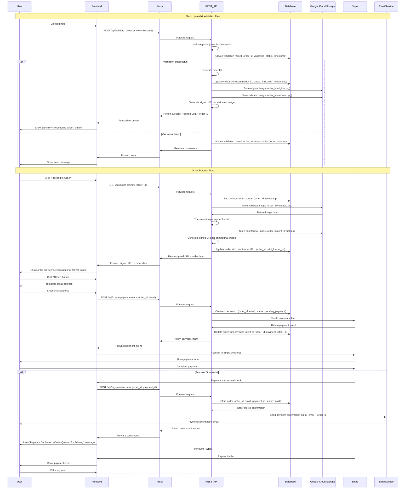
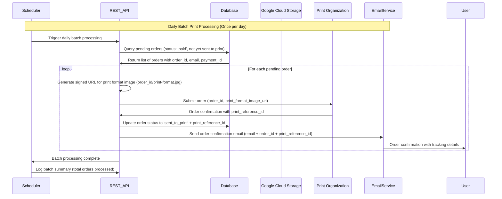

# Photo Validator Application Flow



## Batch Print Processing Flow



## Flow Description

### 1. Photo Upload & Validation
- **User uploads photo** in the React frontend
- **Frontend sends** photo to Vercel proxy (`/api/[...path]`)
- **Proxy forwards** to Python Flask REST API (`/api/validate_photo`)
- **REST API validates** using compliance checker (face detection, size, quality, etc.)

### 2. Storage & Response
- **If validation fails**: Return error reasons to frontend
- **If validation succeeds**: 
  - Generate unique order ID (Cloud Run request ID or timestamp-UUID)
  - Upload original and validated images to Google Cloud Storage
  - Return preview image + order ID to frontend

### 3. Order Process
- **User proceeds** to order copies
- **Request order preview** from backend (`/api/order-preview`)
- **Show order preview screen** with print format image
- **User presses Order** button

### 4. Payment Flow
- **Collect email address** for order tracking
- **Forward to Stripe** for payment processing
- **If payment fails**: Return to payment screen
- **If payment succeeds**: Continue to print organization

### 5. Batch Print Processing
- **Daily scheduler** triggers batch processing
- **Query database** for all paid orders not yet sent to print
- **For each order**:
  - Generate signed URL for the already existing print format image
  - Submit to print organization (order_id + signed URL only)
  - Update order status to 'sent_to_print'
  - Send confirmation email with print reference ID

## Key Components

- **Frontend**: React + TypeScript (Vite)
- **Proxy**: Vercel serverless function
- **Backend**: Python Flask API (Cloud Run)
- **Database**: Order and validation tracking
- **Storage**: Google Cloud Storage
- **Payment**: Stripe integration
- **Email**: Email service for tracking
- **Print Service**: External print organization API
- **Scheduler**: Daily batch processing trigger

## File Structure in GCS

```
order_id/
├── original.jpg          # Original uploaded image
├── validated.jpg         # Validated image (face detection, etc.)
└── print-format.jpg      # Image formatted for printing (generated once)
```
